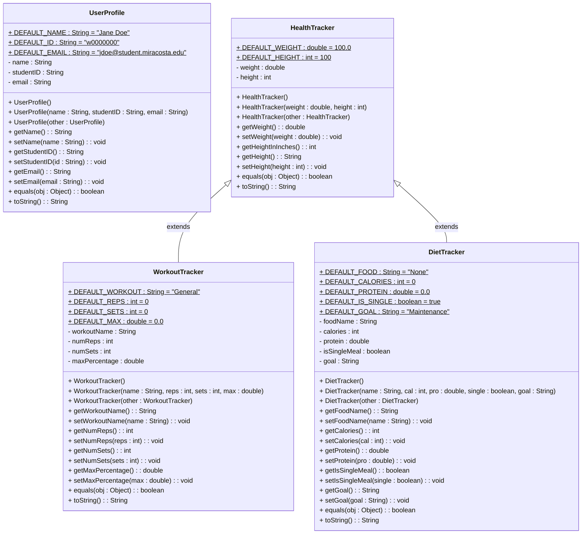

# MCC Tracker
Class-level semester-long project co-created with students

## UML Diagrams

```mermaid
classDiagram
   class UserProfile {
       + DEFAULT_NAME : String = "Jane Doe"$
       + DEFAULT_ID : String = "w0000000"$
       + DEFAULT_EMAIL : String = "jdoe@student.miracosta.edu"$
       - name : String
       - studentID : String
       - email : String
       + UserProfile()
       + UserProfile(name : String, studentID : String, email : String)
       + UserProfile(other : UserProfile)
       + getName() : String
       + setName(name : String) : void
       + getStudentID() : String
       + setStudentID(id : String) : void
       + getEmail() : String
       + setEmail(email : String) : void
       + equals(obj : Object) : boolean
       + toString() : String
   }

   class HealthTracker {
       + DEFAULT_WEIGHT : double = 100.0$
       + DEFAULT_HEIGHT : int = 100$
       - weight : double
       - height : int
       + HealthTracker()
       + HealthTracker(weight : double, height : int)
       + HealthTracker(other : HealthTracker)
       + getWeight() : double
       + setWeight(weight : double) : void
       + getHeightInInches() : int
       + getHeight() : String
       + setHeight(height : int) : void
       + equals(obj : Object) : boolean
       + toString() : String
   }


   class WorkoutTracker {
       + DEFAULT_WORKOUT : String = "General"$
       + DEFAULT_REPS : int = 0$
       + DEFAULT_SETS : int = 0$
       + DEFAULT_MAX : double = 0.0$
       - workoutName : String
       - numReps : int
       - numSets : int
       - maxPercentage : double
       + WorkoutTracker()
       + WorkoutTracker(name : String, reps : int, sets : int, max : double)
       + WorkoutTracker(other : WorkoutTracker)
       + getWorkoutName() : String
       + setWorkoutName(name : String) : void
       + getNumReps() : int
       + setNumReps(reps : int) : void
       + getNumSets() : int
       + setNumSets(sets : int) : void
       + getMaxPercentage() : double
       + setMaxPercentage(max : double) : void
       + equals(obj : Object) : boolean
       + toString() : String
   }


   class DietTracker {
       + DEFAULT_FOOD : String = "None"$
       + DEFAULT_CALORIES : int = 0$
       + DEFAULT_PROTEIN : double = 0.0$
       + DEFAULT_IS_SINGLE : boolean = true$
       + DEFAULT_GOAL : String = "Maintenance"$
       - foodName : String
       - calories : int
       - protein : double
       - isSingleMeal : boolean
       - goal : String
       + DietTracker()
       + DietTracker(name : String, cal : int, pro : double, single : boolean, goal : String)
       + DietTracker(other : DietTracker)
       + getFoodName() : String
       + setFoodName(name : String) : void
       + getCalories() : int
       + setCalories(cal : int) : void
       + getProtein() : double
       + setProtein(pro : double) : void
       + getIsSingleMeal() : boolean
       + setIsSingleMeal(single : boolean) : void
       + getGoal() : String
       + setGoal(goal : String) : void
       + equals(obj : Object) : boolean
       + toString() : String
   }


   HealthTracker <|-- WorkoutTracker : extends
   HealthTracker <|-- DietTracker : extends
```